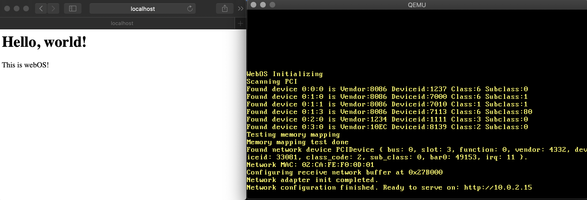

# WEBOS
An extremely simple webserver that runs without an OS. Written in Rust.

Includes limited implementations of ethernet, ip, udp, tcp, dhcp.

## What does it do?
When it boots, it scans the pci-bus to find a rtl8139 network card. If it finds one, it configures it and starts a dhcp client flow. Once it has obtained an ipnumber, it will respond on tcp port 80 as a HTTP server. Any request you send it will be answered with a simple static page.

## Is it fast?
It's actually pretty fast. It can do about 300 req/sec on my macbook pro. To be fair, I took many shortcuts. For instance, the HTTP request is never parsed and a static response is sent. You could argue that this is not really a HTTP server. 

```
$ ab -n 1000 http://127.0.0.1/
...
Concurrency Level:      1
Time taken for tests:   3.208 seconds
Complete requests:      1000
Failed requests:        0
Total transferred:      121000 bytes
HTML transferred:       62000 bytes
Requests per second:    311.75 [#/sec] (mean)
Time per request:       3.208 [ms] (mean)
Time per request:       3.208 [ms] (mean, across all concurrent requests)
Transfer rate:          36.84 [Kbytes/sec] received
$
```
## Installation
I only ever did this on osx, so that's where this is tested. 
```
curl --proto '=https' --tlsv1.2 -sSf https://sh.rustup.rs | sh
cargo install cargo-xbuild bootimage
brew install qemu
# on linux: apt install qemu
rustup override add nightly
rustup component add rust-src
rustup component add llvm-tools-preview
```
## Run the thing!
`cargo xrun`



## Credits
* Webos was based on the work of Philipp Oppermann https://os.phil-opp.com
* A lot of useful info was used from the osdev wiki: https://wiki.osdev.org/Main_Page